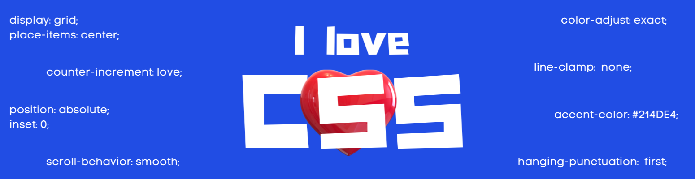

  

   
  

    
    
  

   
  <h1 style="margin: 0;">Do you think CSS is hard? I'm here to help 🙋🏻‍♂️</h1>
  
My hobby is making CSS easier through small pieces of content on Twitter 🐦 CSS is easy and it seems hard to people, why? Because it is not taught from the bottom up. I am looking forward to make CSS easier by bringing up resources that teach core concepts

