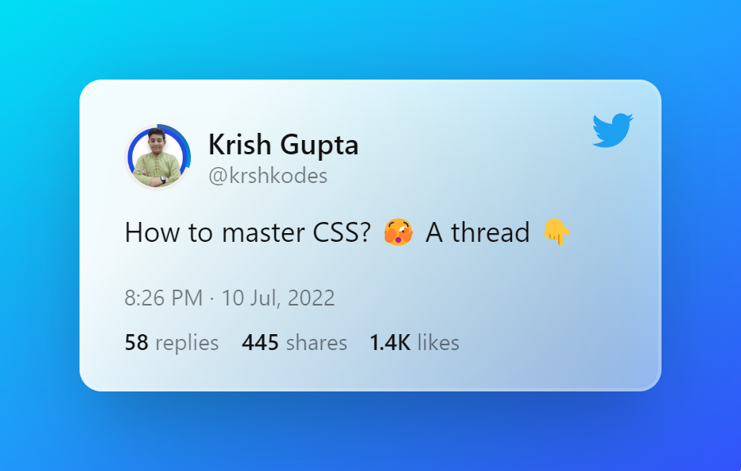

    

      

      

        
        
      

      <h1 style="margin: 0;">Do you think CSS is hard? I'm here to help 🙋🏻‍♂️</h1>
      
My hobby is making CSS easier through small pieces of content on Twitter 🐦 CSS is easy and it seems hard to people, why? Because it is not taught from the bottom up. I am looking forward to make CSS easier by bringing up resources that teach core concepts

    

    <table align="center">
    <tr> <td> <ul align="left" width="40%">
    <li>🎓 High School Freshmen</li>
    <li>👨🏻‍💻 Program Managar, Community Lead and Lead Ambassador at <a href="https://semasoftware.com/">Sema</a> & DevREL Intern at <a href="https://eduhubcommunity.tech/">EduHub</a></li>
    <li>💖 In love with CSS and all things around CSS!</li>
    <li>💭 Ask me about CSS, Open Source, Community Building and JavaScript</li>
  </ul> </td> </tr>
  <tr> <td>  </td> </tr>
</table>
